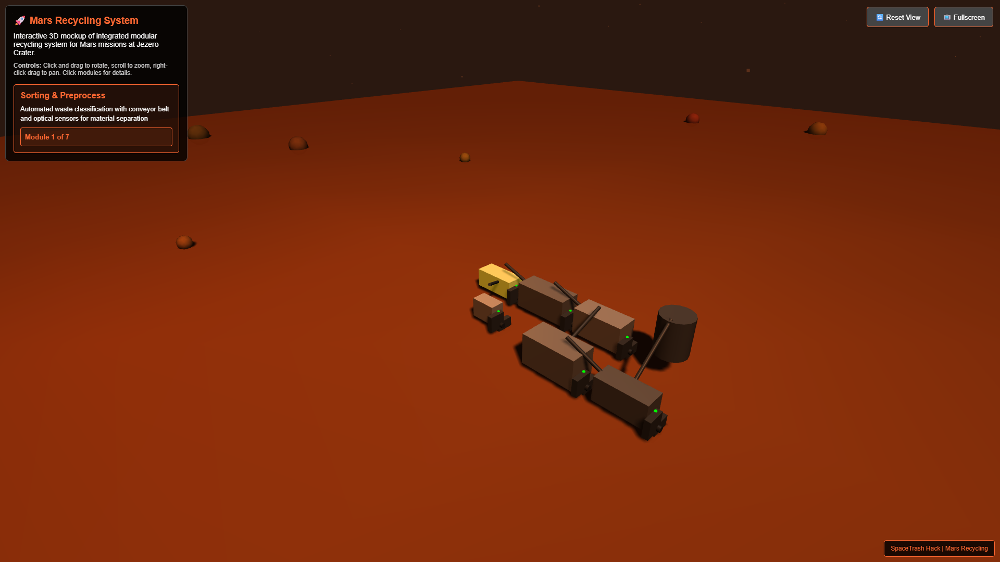

# 🚀 SpaceTrash Hack: Revolutionizing Recycling on Mars

**NASA Space Apps Challenge 2025 - SpaceTrash Hack Challenge**

--- 
### 🚀 **How to Access the Simulation**

1. **Click the Demo Link**: [Mars Recycling System 3D Simulation](https://jsfiddle.net/f3jarsz4/3/)
2. **Click "Run"** to start the simulation
3. **Wait for Loading** - The 3D environment will initialize
4. **Go Full Screen** - Click the fullscreen button for best experience

## 📋 **Project Overview**

SpaceTrash Hack is an innovative Mars recycling system designed to transform inorganic waste into valuable resources for long-duration space missions. Our solution addresses the critical challenge of waste management on Mars by creating a sustainable, closed-loop system that mimics Earth's natural recycling processes.

### 🎯 **Mission Statement**
*"Nature produces zero waste. A leaf falls and becomes food for the soil. Our system is inspired by this principle - it's the 'digestive system' for the Mars habitat, breaking down complex materials, absorbing energy, and rebuilding them into new, useful structures."*

### 🌟 **Key Features**
- **98% Waste Recycling Rate** - Maximum resource recovery
- **7 Integrated Modules** - Modular, scalable design
- **3x Mission Extension** - Reduced dependency on Earth supplies
- **1-3kW Power Consumption** - Energy efficient operation
- **Autonomous Operation** - Minimal crew intervention required

---

## 🛠️ **System Architecture**

Our Mars recycling system consists of seven interconnected modules:

1. **Sorting & Preprocessing Module** - Automated waste categorization
2. **Shred & Dry Module** - Material preparation for processing
3. **Extruder/Filament Module** - Plastic waste conversion
4. **Pyrolysis Micro-Reactor** - Advanced thermal decomposition
5. **Composite 3D Printer** - On-demand manufacturing
6. **Foam Processor** - Insulation material production
7. **Control & Telemetry Module** - System monitoring and control

---

## 🎮 **Interactive 3D Simulation**

### 🎯 **How to Use the Interactive Demo**

1. **Navigate the 3D Space**:
   - **Mouse Drag** = Rotate view around the system
   - **Scroll Wheel** = Zoom in/out
   - **Right Click + Drag** = Pan the view

2. **Interact with Modules**:
   - **Click on any module** to see detailed information
   - **Module details appear** in the upper-left information panel
   - **Learn about each component's** function and specifications

3. **Explore Features**:
   - **7 clickable modules** with individual descriptions
   - **Real-time 3D rendering** with smooth animations
   - **Technical specifications** for each component
   - **Mars environment simulation** with authentic visuals

### 💻 **Technical Requirements**
- **Modern Web Browser** (Chrome, Firefox, Safari, Edge)
- **WebGL Support** (enabled by default in most browsers)
- **Stable Internet Connection** for loading 3D assets
- **Recommended**: Desktop/laptop for optimal experience

---

## 📄 **Project Documentation**

### 📂 **Access All Project Files**

To explore all project materials, including:  
- Full presentation  
- Research paper  
- Demo presentation  
- Three code files representing the project simulation  

Please click the repository link below to access all files:  

🔗 [Repository Link](https://github.com/khion213/SpaceTrash-Mars-Recycling)  

---

## 🌍 **Sustainability Impact**

### 🔄 **Circular Economy Principles**
Our system embodies the circular economy model by:
- **Eliminating Waste**: 98% of inorganic waste is recycled
- **Extending Resource Lifespan**: Multiple reuse cycles
- **Reducing Supply Needs**: Lower dependency on Earth shipments
- **Creating Value**: Waste becomes raw material for new products

### 🚀 **Mission Benefits**
- **Cost Reduction**: Decreased launch requirements and mission costs
- **Mission Extension**: 3x longer operational capability
- **Crew Autonomy**: Self-sufficient resource management
- **Psychological Wellbeing**: Productive engagement with waste management

---

## 🏆 **Competition Context**

**NASA Space Apps Challenge 2025**
- **Challenge Category**: SpaceTrash Hack - Revolutionizing Recycling on Mars
- **Competition Theme**: Sustainable space exploration and resource utilization
- **Submission Date**: October 2025

### 🎯 **Challenge Objectives Met**
✅ Design sustainable waste management system  
✅ Address Mars-specific environmental constraints  
✅ Create scalable and modular solution  
✅ Demonstrate feasibility through simulation  
✅ Present comprehensive technical documentation  

---

## 🔧 **Technical Implementation**

### 🖥️ **3D Simulation Technology Stack**
- **JavaScript** - Core programming language
- **Three.js** - 3D graphics library
- **WebGL** - Hardware-accelerated rendering
- **HTML5 Canvas** - 3D viewport container
- **Responsive Design** - Cross-platform compatibility

### ⚙️ **System Integration**
The simulation demonstrates real-time interaction between all seven modules, showing:
- Material flow between components
- Processing stages and transformations
- Control system interfaces
- Performance metrics and monitoring

---

## 🔬 **Technical Specifications**

- **Operating Environment**: Mars surface conditions
- **Target Location**: Jezero Crater deployment site
- **Power Requirements**: 1-3kW continuous operation
- **Processing Capacity**: Variable based on waste input
- **Module Dimensions**: Optimized for transport efficiency
- **Control System**: Autonomous with telemetry monitoring

---

## 🙏 **Acknowledgments**

- **NASA Space Apps Challenge** - For providing the platform and challenge framework
- **NASA Technical References** - For waste management specifications and Mars environmental data
- **Scientific Community** - For research foundations in space recycling technologies
- **Iraq Space Community** - For local support and collaboration

---

## 📜 **License & Attribution**

This project was developed for the NASA Space Apps Challenge 2025. All technical designs, simulations, and documentation are the intellectual property of Team "Our Future Home Mars".

**Citations and References**: Full bibliography available in the research paper and presentation materials.

---

*"Just as Earth recycles her seasons, so too will humanity recycle its future among the stars."*

---

## 👥 **Team: Our Future Home Mars**

### 🇮🇶 **Team Members**

**Khayoon Alaayedi**
- **Role**: Project Lead & Systems Engineer
- **Location**: Baghdad, Iraq
- **Email**: khion2002@gmail.com

**Lujain Mahdi Siham**
- **Role**: Technical Designer & Research Lead
- **Location**: Baghdad, Iraq
- **Email**: Lujainmahdi614@gmail.com

---

**© 2025 Team Our Future Home Mars | NASA Space Apps Challenge 2025**
